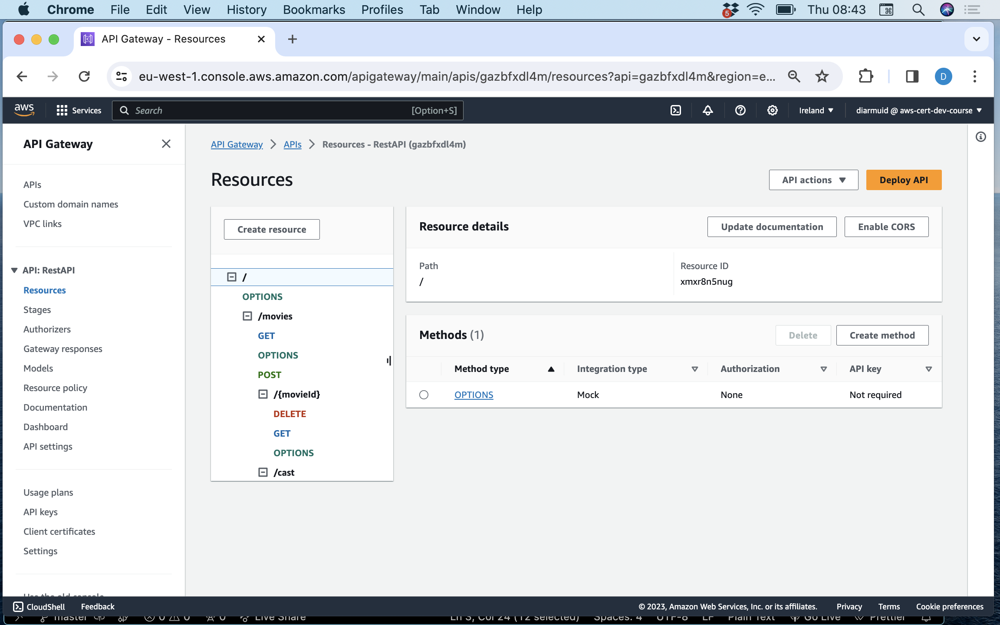
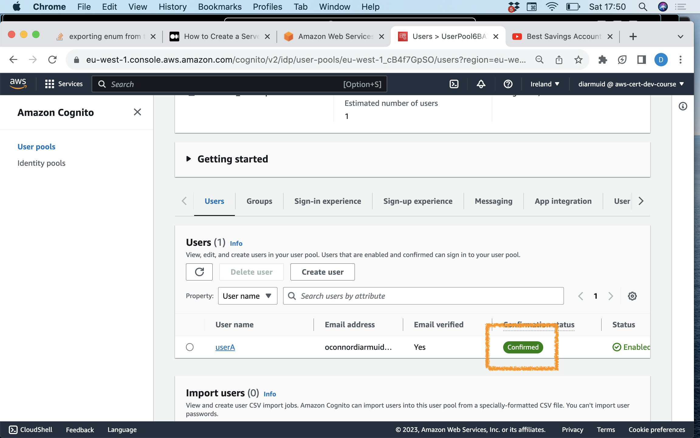

# ServerlessREST Sddignment - Distributed Systems.

__Name:__ ....your name .....

This repository contains the implementation of a serverless REST API for the AWS platform. The infrastructure is created by a CDK stack. The domain context of the API is movie reviews.

## API endpoints.

[ Provide a bullet-point list of the app's endpoints (excluding the Auth API endpoints).]
e.g.
 
+ POST /movies/reviews - add a movie review.
+ GET /movies/{movieId}/reviews - Get all the reviews for a movie with the specified id.
+ GET /movies/{movieId}/reviews?minRating=n - Get all the reviews for the movie with the specified ID with a rating greater than the minRating.
+ GET /movies/{movieId}/reviews/{reviewerName} - Get the review for the movie with the specified movie ID and written by the named reviewer.
+ etc
+ etc

[Include screenshots from the AWS console (API Gateway service) that clearly shows the deployed API ( have legable font size). ]

## Authentication..

[Include a screenshot from the AWS console (Cognito User Pools) that clearly shows a confirmed user account.]

## Independent learning (If relevant).

[ Briefly explain the work you did to satisfy the requirements of the Outstanding grade category, and include proof (e.g. screenshots) of its success. Also, mention the files that contain evidence of this work.

State any other evidence of independent learning achieved while completing this assignment.

